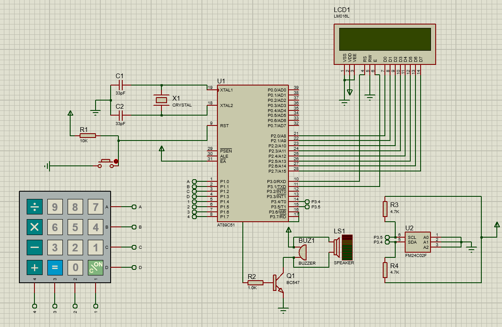
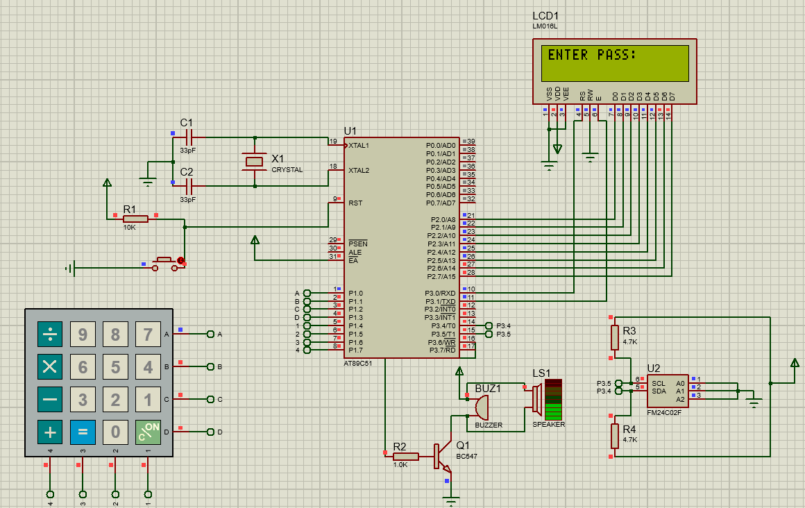
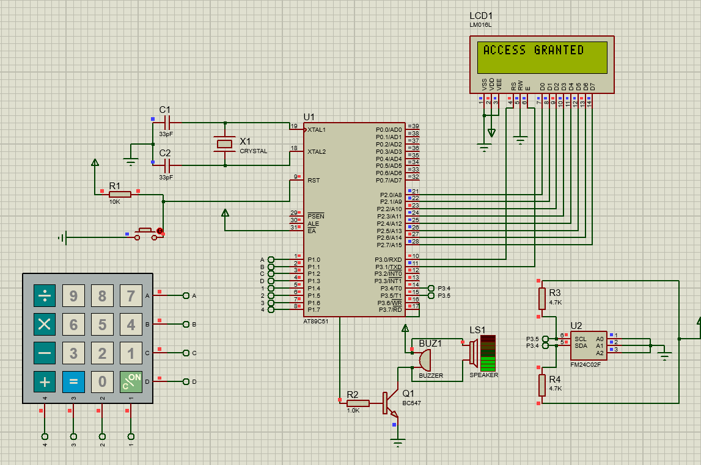
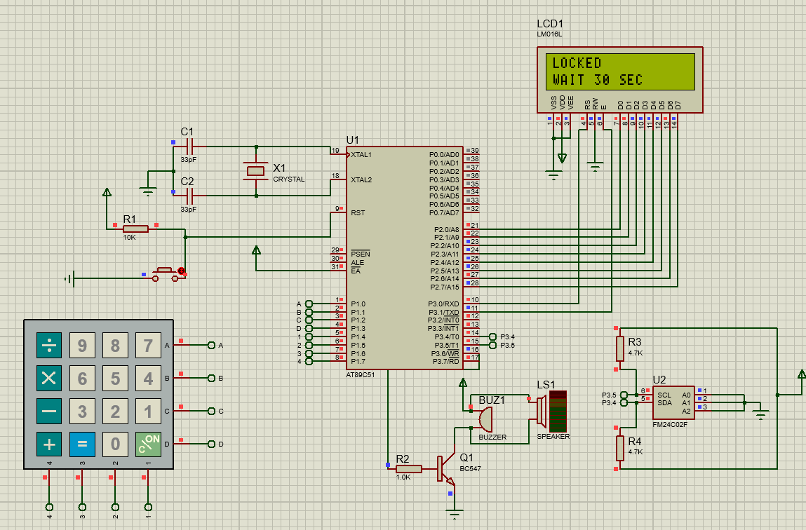
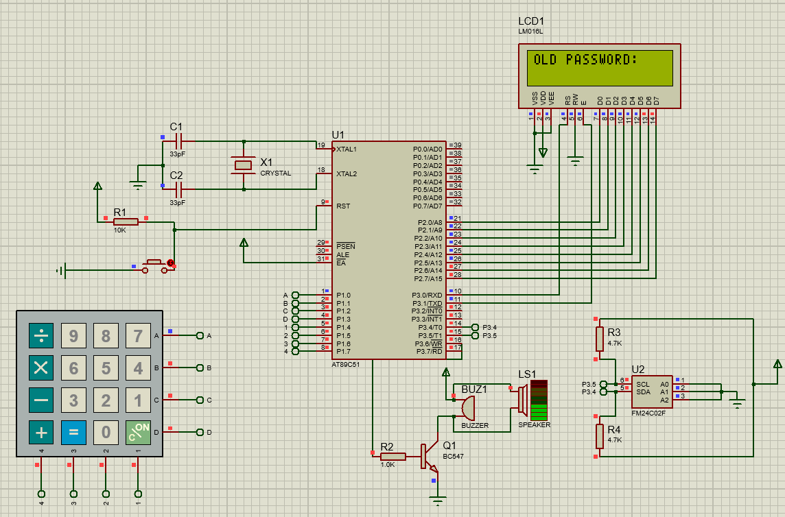
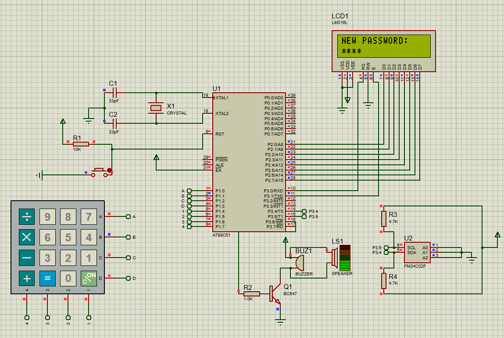

# 🔐 Password Based Lock System Using 8051 and EEPROM

This project is a password protected lock system made using 8051 microcontroller.  
The password is stored in external EEPROM, so it is not lost when power is turned OFF.

The system uses a keypad to enter the password and an LCD to display messages.

---

## 📌 Features
- 4 digit password security
- Password stored in EEPROM (non-volatile memory)
- Change password option
- Buzzer alert for wrong password
- Lock system after 3 wrong attempts
- LCD display for user interface
- Proteus simulation included

---

## 🧰 Components Used
- AT89C51 (8051 Microcontroller)
- 16x2 LCD Display
- 4x4 Matrix Keypad
- 24C02 EEPROM
- Buzzer
- Crystal Oscillator
- Resistors and Capacitors
- Proteus 8 Software

---

## ⚙️ How It Works
1. System shows "ENTER PASS" on LCD.
2. User enters password using keypad.
3. Microcontroller checks password with EEPROM.
4. If correct → Access Granted.
5. If wrong → Buzzer sounds.
6. After 3 wrong tries → System is locked.
7. User can change password using 'D' key.

---

## ▶️ How To Run
1. Open the Proteus file.
2. Load the HEX file in 8051.
3. Run simulation.
4. Enter password using keypad.

Default Password: 2005

---

## 📁 Project Files
- Code folder contains C program
- Proteus folder contains simulation file
- Images folder contains circuit screenshots

---

## 👨‍💻 Author
Ganesh  
ECE Student | Embedded Systems Enthusiast

---

## 📜 License
This project is for learning and educational purpose.

---

## Circuit Diagram

---

## Working Demo

- Enter 4-digit password
- Press # to submit
- Press D(div symbol) to change password
- After 3 wrong attempts system locks
  
---

## Simulation Results

### Enter Password

### Access Granted

### Wrong Password

### System Locked

### Enter Old Password

### Set New Password

### Password Updated

